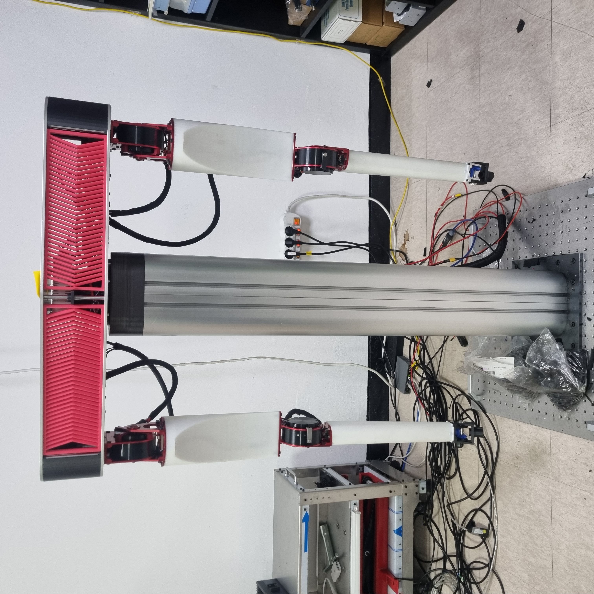

# Ubuntu-Based CAN Communication Robot Drummer
This project is a unique endeavor that leverages CAN communication to control nine motors within a Linux Ubuntu environment, enabling a robot to play drums. It's designed for music enthusiasts and tech aficionados alike, blending robotics with artistry to create rhythmic music.

## Background and Purpose
This project, led by Dr. Sehyeok Im of the Intelligent Robotics Research Division at the Korea Institute of Science and Technology, was embarked upon to merge the realms of robotics and music. The initiative's main objective was to create a robotic drummer, demonstrating sophisticated control over nine motors and real-time processing in a musical context.

Under the guidance of Dr. Im, SeongYong Park contributed significantly to this project by implementing the technology stack and features. The challenges addressed included achieving precise motor synchronization, adapting rhythm generation to various music genres, and maintaining responsive system performance. 

The project's significance lies in its novel approach to blending robotic accuracy with the art of music. Utilizing C++, Linux Ubuntu with a Real-Time Kernel, and the CAN Bus Protocol with the SocketCAN Library, it pushes the frontiers of robotic interaction in musical performances. Additionally, the incorporation of Qt for GUI development, USB IO devices, and proximity sensors, underlines the project's advanced application of technology in an artistic and creative setting.

This endeavor stands as a testament to the potential of robotics in the arts, showcasing how robots can be more than mere tools, but active participants and contributors to the field of music.

## Team Members
- **SeongYong Park**: Key developer responsible for the entire project's core components. Developed advanced algorithms in C++ for precision motor control, implemented real-time system performance using Linux Ubuntu with a Real-Time Kernel, and integrated control logic with a collaboratively developed Qt user interface Also responsible for implementing the CAN Bus Protocol with SocketCAN Library for motor communications, and incorporating USB IO devices and proximity sensors for accurate robotic movement and positioning.

<!-- - **Partner's Name**: Partner's role and contributions in the project-->

## Features
- **Precision Motor Control**: Utilizing advanced algorithms in C++ to control Tmotor and Maxon motors with high precision, enabling accurate and dynamic drumming.
- **Real-Time System Performance**: Leveraging Linux Ubuntu with a Real-Time Kernel to ensure immediate response and consistent performance during drumming sequences.
- **Integrated User Interface**: A collaborative effort in Qt for GUI development, focusing on seamless integration between the control logic and user interface for intuitive user interaction.
- **Efficient Motor Communication**: Implementing the CAN Bus Protocol with SocketCAN Library for reliable and efficient communication between the control system and motors.
- **Robust Sensory Feedback**: Incorporating USB IO devices and proximity sensors for precise homing and positioning, enhancing the overall accuracy and consistency of the robot's movements.

## Technology Stack

### Software
- **C++**: Used for core algorithm development and motor control logic.
- **Linux Ubuntu with Real-Time Kernel**: Operating system platform modified for robust and stable performance with real-time capabilities.
- **Qt (GUI Development)**: Collaboratively developed with another developer, focusing on integrating the control logic with the GUI for enhanced user interaction.
- **SocketCAN Library**: Employed for implementing the CAN Bus Protocol, facilitating efficient communication with the motors.
- **Multi-Threading**: Implemented throughout the system to manage concurrent processes effectively. This approach is crucial for real-time data processing, ensuring synchronized motor control and maintaining system stability under various operational conditions.

### Hardware
- **Tmotor AK10-9 and AK70-10 Motors**: High-performance motors used for precise and powerful drumming actions.
- **Maxon Motor (EPOS4 CAN compact 50/15)**: Integrated for precise motor control, contributing to the accuracy and consistency of the drumming robot.
- **USB IO Device**: Used exclusively for connecting and interfacing with sensors.
- **Proximity Sensors**: Employed for homing purposes, ensuring accurate positioning and movement of the robot.
- **Peak USBtoCAN Device**: Used to interface the system with CAN networks, ensuring reliable communication with motor controllers.

## Installation & Usage
To set up and use this robotic drummer, please follow the outlined steps:

1. **Setup Linux Ubuntu Environment with Real-Time Kernel**: Ensure that you have a Linux Ubuntu environment with a Real-Time Kernel installed for optimal performance.

2. **Clone the Project Repository**: Clone the project from GitHub using the command `git clone [repository link]`.

3. **Install Qt for GUI Development (If Applicable)**: If involved in GUI development, install Qt for creating and managing the user interface.

4. **Install SocketCAN Library**: Install the SocketCAN library for CAN Bus communication, which is crucial for motor control.

5. **Connect and Configure Motors and Sensors**:
    - Connect Tmotor and Maxon motors via the Peak USBtoCAN device.
    - Setup USB IO devices and proximity sensors for accurate positioning and motor synchronization.

6. **Compile and Run the Control Software**:
    - Compile the C++ based control software.
    - Execute the compiled program to start the robotic drummer.

Remember to adjust these steps based on your project's specific requirements and the hardware components used.

## Screenshots and Demo
Include some screenshots of your project in action, and/or links to demo videos.

<!--  
[Link to Demo Video](url-to-demo)-->

## License
State the license under which the project is available. Example: This project is licensed under the MIT License - see the LICENSE.md file for details.

## Contact and Additional Information

For any questions, feedback, or further information, feel free to reach out to us:

- **SeongYong Park**
  - Email: park50260@gmail.com
  - Resume : [Go to Resume](https://aconite-green.github.io/)
  <!--- LinkedIn: [Go to LinkedIn ](your-linkedin-url)-->
  - 
<!-- - **Your Teammate's Name**
  - Email: teammate.email@example.com
  - LinkedIn: [Teammate's LinkedIn](teammate-linkedin-url)-->

Additional resources and information:
- Project Link: [handover document](https://seongyongs-organization.gitbook.io/design-system/)

